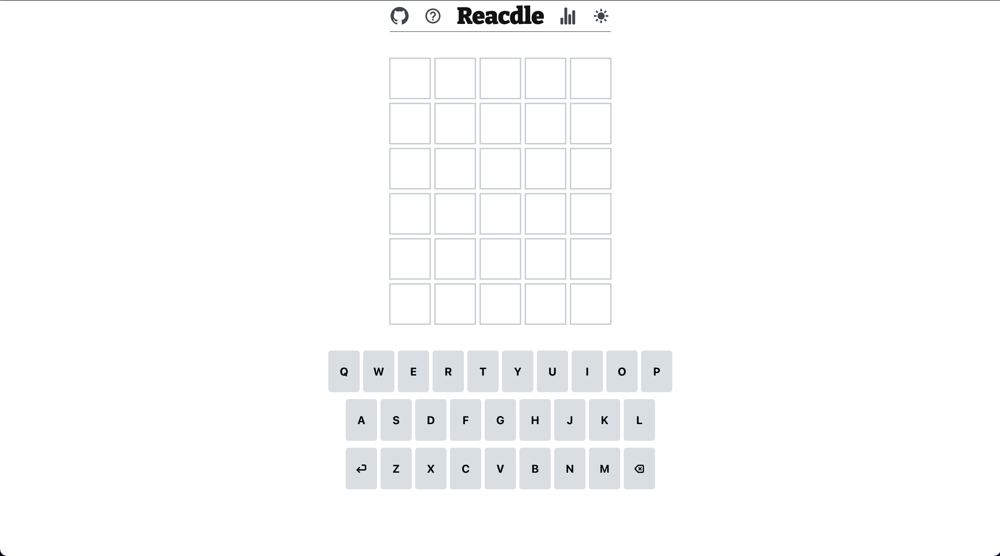
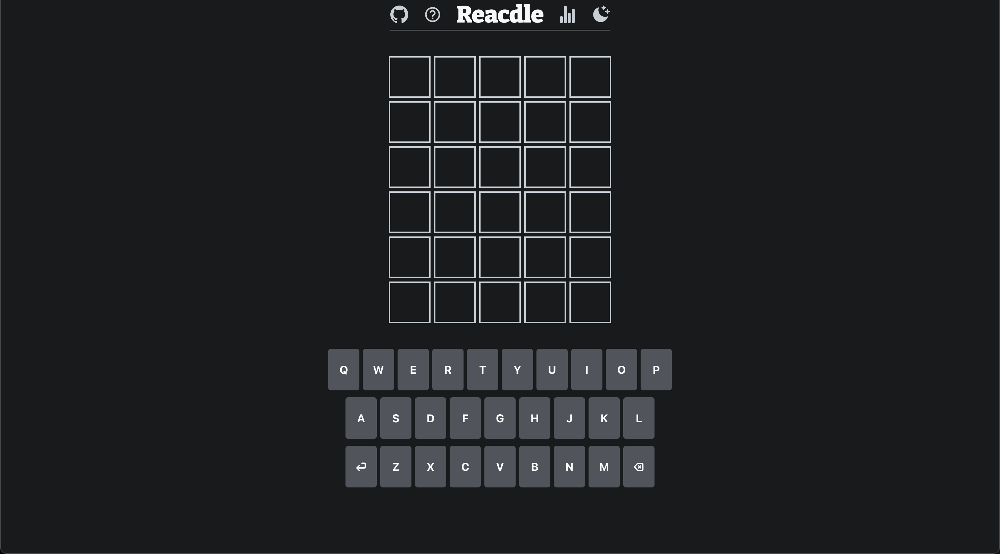
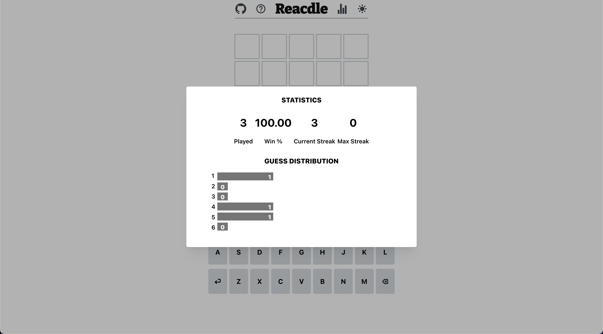

<br/>
<p align="center">
  <a href="https://github.com/davidperjac/react-wordle-clon">
    
  </a>

  <h3 align="center">Reacdle</h3>

  <p align="center">
    A Wordle clon built just with React!
    <br/>
    <br/>
    <a href="https://reacdle.netlify.app/">View Demo</a>
  </p>
</p>

   

## Table Of Contents

* [About the Project](#about-the-project)
* [Built With](#built-with)
* [Getting Started](#getting-started)
  * [Installation](#installation)
* [Usage](#usage)
* [Authors](#authors)

## About The Project



Reacdle is a Wordle clone built using React. This project was created with the goal of providing a fun and interactive game that challenges players to guess a secret five-letter word using a limited number of attempts.

Reacdle features a simple and intuitive user interface that allows players to easily enter their guesses and receive feedback on their progress. The game logic is implemented using JavaScript, with the React framework handling the rendering of the user interface.

This project serves as an excellent introduction to React for beginners who are looking to build their skills in front-end web development. It also provides a challenging and entertaining game that can be enjoyed by players of all ages and skill levels.

Feel free to clone this repository and customize it to suit your needs or contribute to the development of the project by submitting pull requests or opening issues.

## Built With

The technologies used for this project were:

* [React](https://es.react.dev/)
* [Mantine](https://mantine.dev/)
* [Redux](https://redux.js.org/)

## Getting Started

To use this application, simply clone the repository, install the dependencies, and start the development server. Here are the steps:

### Installation

1. Clone the repo

```sh
git clone https://github.com/davidperjac/react-wordle-clon.git
```

2. Install NPM packages

```sh
npm install
```

3. Start the development server

```
npm start
```

4. Open your web browser and go to `http://localhost:3000`

## Usage

Reacdle implements all the functionalities of the Wordle game.

- Animations


- Dark Mode


- Statistics


- One word per day 

## Authors

* **David Perez** - *FullStack Developer* - [David Perez](https://github.com/davidperjac) - *App*
